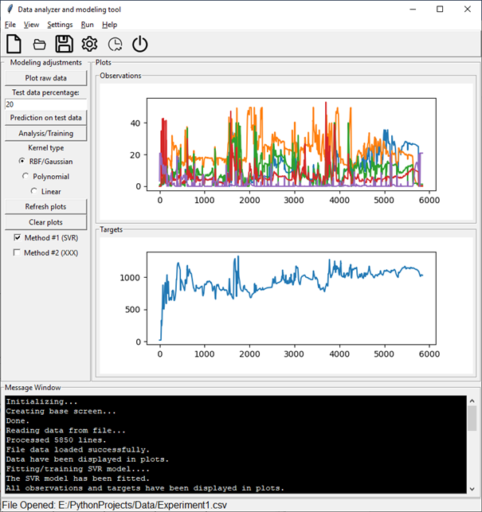
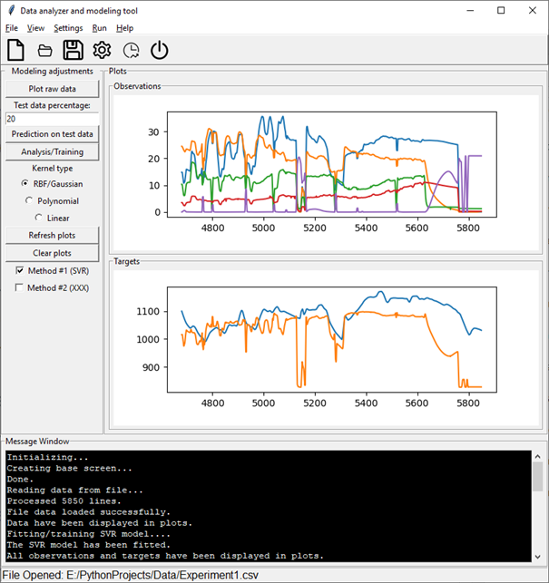

# PythonScriptUCGPredictionGUI
Python Script for Modeling and Predicting UCG Process Data

Vykreslenie surových dát (Raw data plot): 
Vstupy (observation) sú namerané koncetrácie plynu syngas z UCG (prvý graf).
Modelovaným výstupom (cieľom/target) je teplota UCG georektore (druhý graf).

Predikcia na testovacích dátach:
Naučený (natrénovaný) strojový SVR model predikuje teplotu v georektore na vstupoch (pozorovaniach/koncentráciách), ktoré nepozná (nevstupovali do trénovania).
Namerané (neznáme vstupné) pozorovania (koncentrácie) – prvý graf:

